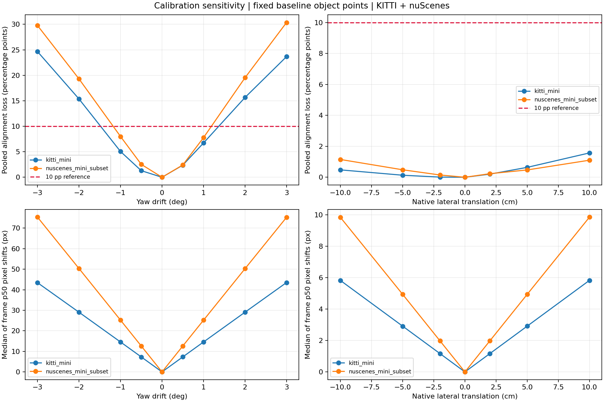
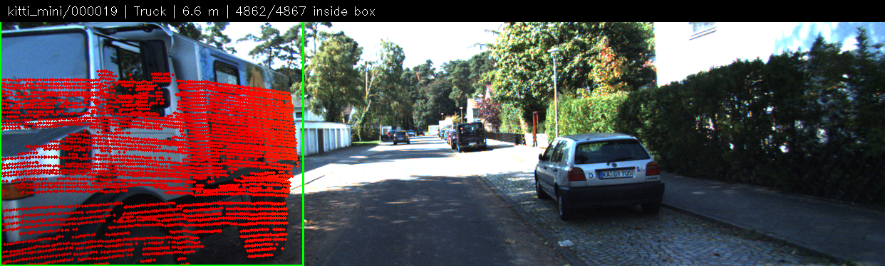
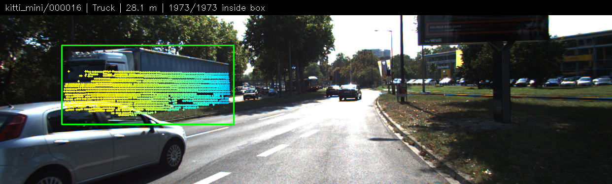
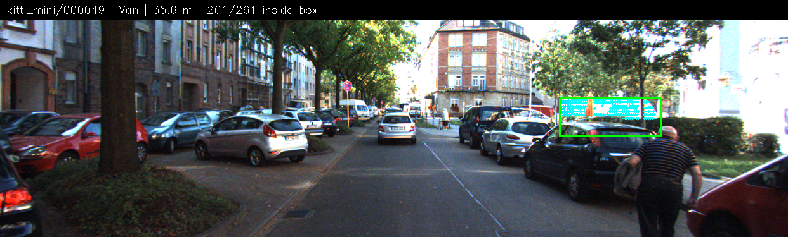
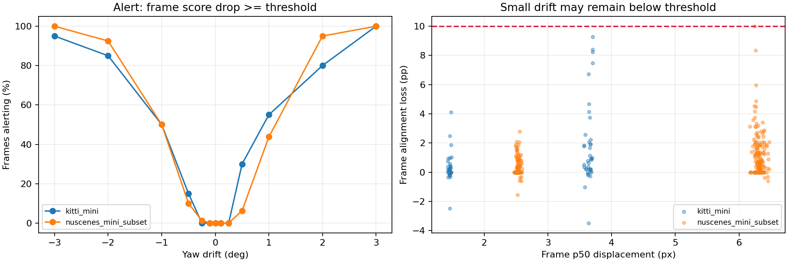

# Phụ lục: Phương pháp, kết quả chi tiết và kiểm chứng cá nhân

Tài liệu bổ trợ cho [báo cáo chính](REPORT.md). Các số liệu và hình dưới đây được giữ từ thí nghiệm đã chạy; phần kiểm chứng cá nhân chỉ ghi nhận sau khi học viên thực hiện.

## A. Thiết kế và kết quả đầy đủ

**Thiết kế:** mỗi frame chạy 9 mức yaw `0, ±0.5, ±1, ±2, ±3°`, 7 mức dịch ngang `0, ±2, ±5, ±10 cm` và 4 mức yaw nhỏ `±0.1, ±0.25°`: tổng **2.000 cấu hình**, **26.160 dòng object**. Chỉ thay một yếu tố mỗi lần; không thay point cloud, label hay frame; seed 42 được ghi lại, không có lấy mẫu ngẫu nhiên. Yaw quay quanh z-up; dịch ngang theo y-left KITTI và x-right nuScenes, nên dấu dịch ngang khác hướng trái/phải giữa hai dataset. Giữ bù ego motion của nuScenes.

**Metric:** chọn điểm nằm trong box 3D GT và trong FOV của calibration baseline, cố định ID điểm và box 2D tương ứng. `score = 100 × số điểm chiếu vào đúng box 2D / số điểm baseline`; điểm mất FOV sau perturb vẫn nằm trong mẫu số và tính là mismatch. Score frame/dataset gộp theo số cặp điểm–object, không phải trung bình đều các object; box chồng lấn có thể đếm một điểm ở nhiều object. `drop_pp = score_baseline − score_perturb`; cảnh báo **từng frame** khi `drop_pp ≥ 10`. Object không có điểm được ghi NaN, không coi là pass. Tỷ lệ FOV chia số điểm XYZ hữu hạn; độ dịch pixel dùng cùng ID điểm còn trong FOV ở cả hai cấu hình, số điểm mất FOV được ghi riêng.

| Dataset | Perturb | Điểm trong FOV (%) | Score đúng box (%) | Giảm (pp) | Dịch pixel* | Frame cảnh báo (%) |
|---|---|---:|---:|---:|---:|---:|
| KITTI | yaw 0° | 15,740 | 99,565 | 0,000 | 0,00 | 0 |
| KITTI | yaw +0,5° | 15,747 | 97,196 | 2,369 | 7,30 | 30 |
| KITTI | yaw +1° | 15,750 | 92,839 | 6,725 | 14,58 | 55 |
| KITTI | yaw +2° | 15,751 | 83,909 | 15,655 | 29,07 | 80 |
| KITTI | yaw +3° | 15,760 | 75,905 | 23,660 | 43,50 | 100 |
| nuScenes | yaw 0° | 8,727 | 99,937 | 0,000 | 0,00 | 0 |
| nuScenes | yaw +0,5° | 8,723 | 97,527 | 2,410 | 12,61 | 6,25 |
| nuScenes | yaw +1° | 8,723 | 92,161 | 7,776 | 25,18 | 43,75 |
| nuScenes | yaw +2° | 8,718 | 80,412 | 19,525 | 50,25 | 95 |
| nuScenes | yaw +3° | 8,712 | 69,586 | 30,351 | 75,24 | 100 |
| KITTI | dịch ngang +10 cm | 15,746 | 97,992 | 1,572 | 5,82 | 5 |
| nuScenes | dịch ngang +10 cm | 8,724 | 98,834 | 1,103 | 9,84 | 0 |

*Dịch pixel là trung vị của p50 từng frame, **không phải** p50 gộp toàn bộ điểm và **không phải latency**. Bảng đầy đủ cả perturb âm, p95 và mức nhỏ: [calibration_summary.csv](../results/calibration_summary.csv); chi tiết: [calibration_frames.csv](../results/calibration_frames.csv), [calibration_objects.csv](../results/calibration_objects.csv).

Ở +3°, score nhóm xa >30 m giảm **74,28 pp KITTI / 63,78 pp nuScenes**, so với nhóm gần <10 m giảm **13,90 / 19,63 pp**: box nhỏ ở xa dễ mất điểm khi lệch góc. Khoảng cách là norm của bottom center trong camera frame; nhóm giữa 10–30 m gồm hai đầu mút. Xem [range_summary.csv](../results/range_summary.csv).

**So sánh sensor và giới hạn:** trung bình KITTI có 119.318,45 điểm/frame, nuScenes 34.718,80; ảnh KITTI khoảng 1242×375, nuScenes 1600×900 và tiêu cự theo pixel lớn hơn, nên cùng yaw drift tạo độ dịch pixel khác nhau. nuScenes camera sớm hơn LiDAR 34,232–39,535 ms; starter đã bù ego motion, chưa loại hết sai lệch vật thể chuyển động. Với +3°, score scene ban ngày giảm 32,04 pp, scene đêm giảm 28,91 pp; bố cục và traffic khác nhau nên không kết luận ánh sáng là nguyên nhân. Xem [scene_summary.csv](../results/scene_summary.csv).

**Quan trọng với nuScenes:** starter suy ra box 2D từ box 3D bằng calibration baseline và xấp xỉ box bằng yaw-only; box 2D này không phải annotation camera độc lập. Baseline score gần 100% có tính phụ thuộc hình học; thí nghiệm đo độ nhạy với drift giả lập, không chứng minh calibration gốc chính xác tuyệt đối. KITTI cũng có occlusion/truncation và không kiểm tra che khuất bằng z-buffer. Hai lần chạy cho **6 CSV benchmark và experiment_config.json giống từng byte**; số liệu trong bảng được làm tròn từ CSV. Nguồn ảnh: **KITTI Vision Benchmark Suite** và **nuScenes (Motional)**, dữ liệu do đề bài cung cấp.

## B. Lựa chọn ngưỡng cảnh báo

Ngưỡng giảm **10 điểm phần trăm (pp)** được chọn trước khi chạy sweep để minh họa một mức giảm dễ diễn giải: với mẫu số cố định 100 cặp điểm–object, số cặp chiếu đúng box giảm 10 cặp sẽ làm score giảm 10 pp. Đây là ngưỡng thử nghiệm, chưa tối ưu theo dữ liệu hoặc hiệu chỉnh trên log sạch độc lập. Quy tắc dùng score từng frame; đường 10 pp trên biểu đồ score gộp dataset chỉ là mốc tham chiếu.

Ở yaw +1°, quy tắc chỉ cảnh báo 55% frame KITTI và 43,75% frame nuScenes; ở +3° là 100% trên cả hai subset. Với +0,25° nuScenes, độ dịch tổng hợp là 6,31 px nhưng không frame nào cảnh báo. Tỷ lệ cảnh báo ở mức 0° so với chính baseline không phải phép đo báo động giả trên log vận hành độc lập. Trường hợp bỏ sót yaw −2° được phân tích trong mục 3 báo cáo chính.

## C. Kiểm chứng cá nhân của học viên

**Trạng thái: học viên chưa xác nhận đã tự thực hiện các bước dưới đây trong phiên làm việc.** Agent đã kiểm thử và đối chiếu kết quả; việc đó không thay thế phần kiểm chứng cá nhân theo RULES.md. Sau khi tự chạy, cập nhật cột cuối bằng kết quả thực tế, rồi bổ sung một câu tương ứng vào mục 6 báo cáo chính.

| Bước học viên tự thực hiện | Lệnh hoặc thao tác | Kết quả cần kiểm tra | Tình trạng xác nhận |
|---|---|---|---|
| Kiểm tra hình học và metric | `python -m unittest src.test_projection_qa` | 9 kiểm thử đạt; giải thích phép rectification, lọc depth và mẫu số cố định | Chưa xác nhận |
| Kiểm tra điểm chuẩn và ảnh baseline | Chạy ba lệnh `starter.projection` trong mục 5 báo cáo; mở ảnh xuất ra | Điểm synthetic `(10,0,0)` cho depth khoảng 9,73 m, pixel gần (614,175); xem điểm chiếu lên vật thể | Chưa xác nhận |
| Kiểm tra tái lập | Chạy benchmark chính, lần lặp CSV-only và `python -m src.check_results --compare-dir /tmp/day6-qa-repeat` | Các CSV/config giống nhau trong cùng môi trường; hiểu phép tính score và drop_pp | Chưa xác nhận |
| Kiểm tra failure và bài nộp | Mở hai ảnh `fail_*.png`, đối chiếu CSV; chạy `python tools/check_submission.py` | Giải thích 108/108 → 0/108 và trường hợp 31/31 vẫn trong box dù dịch 60,62 px; checker PASS | Chưa xác nhận |

Các lệnh dùng môi trường đã cài ở mục 5 báo cáo. Ghi lại cả lỗi hoặc sai khác nếu có; không xác nhận bước chưa thực hiện. Hướng dẫn giải thích kết quả trong ba phút: [PRESENTATION.md](PRESENTATION.md).
