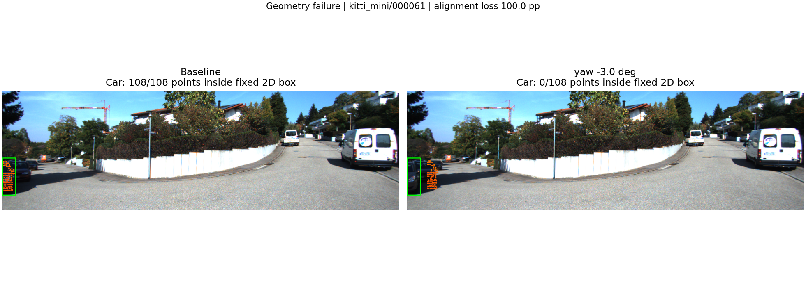
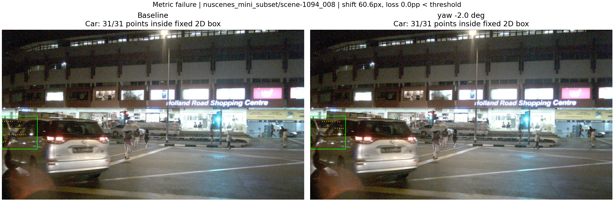

# Báo cáo Day 6: Độ nhạy projection LiDAR–camera với calibration drift

- **Họ tên:** Vũ Thường Tín
- **MSSV:** 2A202602955
- **Lớp:** K4 Track 4
- **Link repo:** https://github.com/Nituv05/K4-Track4-Day06-VuThuongTin-2A202602955-3D-From-Point-Clouds
- **Topic:** A — LiDAR-camera projection QA, mức Advanced
- **Dataset:** `data/synthetic` để kiểm thử; `data/kitti_mini` và `data/nuscenes_mini_subset` để benchmark.
- **Các frame đã dùng:** KITTI: 000001, 000004, 000007, 000008, 000009, 000010, 000011, 000012, 000015, 000016, 000019, 000021, 000023, 000025, 000031, 000032, 000043, 000048, 000049, 000061; nuScenes: scene-0103_000–039 và scene-1094_000–039. Xem [frames.csv](../results/frames.csv).

## 1. Claim

**Trên 20 frame KITTI và 80 frame nuScenes, yaw drift +3° làm tỷ lệ điểm của vật thể chiếu vào đúng box 2D giảm lần lượt 23,66 và 30,35 điểm phần trăm so với baseline.** Ở +1°, ngưỡng giảm 10 điểm phần trăm chỉ cảnh báo 55% frame KITTI và 43,75% frame nuScenes: score trong box có thể bỏ sót drift đáng kể. Đây là kết quả trên subset đã khảo sát, không phải bảo đảm cho mọi sensor hoặc điều kiện vận hành.

## 2. Evidence

**Thiết kế:** mỗi frame chạy 9 mức yaw `0, ±0.5, ±1, ±2, ±3°`, 7 mức dịch ngang `0, ±2, ±5, ±10 cm` và 4 mức yaw nhỏ `±0.1, ±0.25°`: tổng **2.000 cấu hình**, **26.160 dòng object**. Chỉ thay một yếu tố mỗi lần; không thay point cloud, label hay frame; seed 42 được ghi lại, không có lấy mẫu ngẫu nhiên. Yaw quay quanh z-up; dịch ngang theo y-left KITTI và x-right nuScenes, nên dấu dịch ngang khác hướng trái/phải giữa hai dataset. Giữ bù ego motion của nuScenes.

**Metric:** chọn điểm nằm trong box 3D GT và trong FOV của calibration baseline, cố định ID điểm và box 2D tương ứng. `score = 100 × số điểm chiếu vào đúng box 2D / số điểm baseline`; điểm mất FOV sau perturb vẫn nằm trong mẫu số và tính là mismatch. Score frame/dataset gộp theo số cặp điểm–object, không phải trung bình đều các object; box chồng lấn có thể đếm một điểm ở nhiều object. `drop_pp = score_baseline − score_perturb`; cảnh báo **từng frame** khi `drop_pp ≥ 10`. Object không có điểm được ghi NaN, không coi là pass. Tỷ lệ FOV chia số điểm XYZ hữu hạn; độ dịch pixel dùng cùng ID điểm còn trong FOV ở cả hai cấu hình, số điểm mất FOV được ghi riêng.

| Dataset | Perturb | Điểm trong FOV (%) | Score đúng box (%) | Giảm (pp) | Dịch pixel* | Frame cảnh báo (%) |
|---|---|---:|---:|---:|---:|---:|
| KITTI | yaw 0° | 15,740 | 99,565 | 0,000 | 0,00 | 0 |
| KITTI | yaw +0,5° | 15,747 | 97,196 | 2,369 | 7,30 | 30 |
| KITTI | yaw +1° | 15,750 | 92,839 | 6,725 | 14,58 | 55 |
| KITTI | yaw +2° | 15,751 | 83,909 | 15,655 | 29,07 | 80 |
| KITTI | yaw +3° | 15,760 | 75,905 | 23,660 | 43,50 | 100 |
| nuScenes | yaw 0° | 8,727 | 99,937 | 0,000 | 0,00 | 0 |
| nuScenes | yaw +0,5° | 8,723 | 97,527 | 2,410 | 12,61 | 6,25 |
| nuScenes | yaw +1° | 8,723 | 92,161 | 7,776 | 25,18 | 43,75 |
| nuScenes | yaw +2° | 8,718 | 80,412 | 19,525 | 50,25 | 95 |
| nuScenes | yaw +3° | 8,712 | 69,586 | 30,351 | 75,24 | 100 |
| KITTI | dịch ngang +10 cm | 15,746 | 97,992 | 1,572 | 5,82 | 5 |
| nuScenes | dịch ngang +10 cm | 8,724 | 98,834 | 1,103 | 9,84 | 0 |

*Dịch pixel là trung vị của p50 từng frame, **không phải** p50 gộp toàn bộ điểm và **không phải latency**. Bảng đầy đủ cả perturb âm, p95 và mức nhỏ: [calibration_summary.csv](../results/calibration_summary.csv); chi tiết: [calibration_frames.csv](../results/calibration_frames.csv), [calibration_objects.csv](../results/calibration_objects.csv).


Ở +3°, score nhóm xa >30 m giảm **74,28 pp KITTI / 63,78 pp nuScenes**, so với nhóm gần <10 m giảm **13,90 / 19,63 pp**: box nhỏ ở xa dễ mất điểm khi lệch góc. Khoảng cách là norm của bottom center trong camera frame; nhóm giữa 10–30 m gồm hai đầu mút. Xem [range_summary.csv](../results/range_summary.csv).


**So sánh sensor và giới hạn:** trung bình KITTI có 119.318,45 điểm/frame, nuScenes 34.718,80; ảnh KITTI khoảng 1242×375, nuScenes 1600×900 và tiêu cự theo pixel lớn hơn, nên cùng yaw drift tạo độ dịch pixel khác nhau. nuScenes camera sớm hơn LiDAR 34,232–39,535 ms; starter đã bù ego motion, chưa loại hết sai lệch vật thể chuyển động. Với +3°, score scene ban ngày giảm 32,04 pp, scene đêm giảm 28,91 pp; bố cục và traffic khác nhau nên không kết luận ánh sáng là nguyên nhân. Xem [scene_summary.csv](../results/scene_summary.csv).

**Quan trọng với nuScenes:** starter suy ra box 2D từ box 3D bằng calibration baseline và xấp xỉ box bằng yaw-only; box 2D này không phải annotation camera độc lập. Baseline score gần 100% có tính phụ thuộc hình học; thí nghiệm đo độ nhạy với drift giả lập, không chứng minh calibration gốc chính xác tuyệt đối. KITTI cũng có occlusion/truncation và không kiểm tra che khuất bằng z-buffer. Hai lần chạy cho **6 CSV benchmark và experiment_config.json giống từng byte**; số liệu trong bảng được làm tròn từ CSV. Nguồn ảnh: **KITTI Vision Benchmark Suite** và **nuScenes (Motional)**, dữ liệu do đề bài cung cấp.

## 3. Failure case



**Geometry:** KITTI `000061`, Car #1 ở 14,81 m, yaw −3°: từ **108/108** điểm trong box xuống **0/108**, dịch p50 **62,10 px**. Calibration drift làm điểm chiếu sang vị trí không còn khớp xe; đây là drift giả lập, không phải lỗi dataset gốc. Object bị cắt bởi mép ảnh (`truncated=0,79`), nên rất nhạy và không đại diện mọi xe. Phát hiện bằng score từng object cùng overlay, kiểm tra extrinsic và giá đỡ sensor.



**Metric:** nuScenes `scene-1094_008`, Car #0 ở 20,50 m, yaw −2°: dịch p50 **60,62 px** nhưng vẫn **31/31** điểm trong box rộng. Score object không giảm; score frame chỉ giảm **6,63 pp**, dưới ngưỡng 10, nên không cảnh báo dù p50 cả frame dịch 50,46 px. Box rộng và việc gộp theo số điểm che lỗi. Khắc phục bằng kiểm tra từng object/nhóm khoảng cách và thêm score khớp cạnh ảnh hoặc mốc calibration độc lập; không chứng nhận calibration đúng chỉ vì score cao. Với yaw nhỏ, +0,25° trên nuScenes dịch p50 tổng hợp 6,31 px nhưng không frame nào cảnh báo. Xem [evidence.csv](../results/evidence.csv).

## 4. Khuyến nghị nếu triển khai thật

- **Use-case ADAS:** QA calibration LiDAR–camera trước khi fusion hoặc hỗ trợ gán nhãn; đưa frame thiếu support vào hàng chờ review, không tự động coi là dữ liệu sạch.
- Ghi log số điểm hữu hạn, tỷ lệ FOV, điểm mất FOV, support từng object, score theo khoảng cách/class, timestamp gap và phiên bản calibration. Tỷ lệ FOV gần như không đổi ở sweep yaw nên riêng chỉ số này không đủ phát hiện drift.
- Ngưỡng **10 pp là lựa chọn thử nghiệm**, chưa hiệu chỉnh trên tập log sạch độc lập; mức 0° so với chính baseline không đo được báo động giả trong vận hành. Score hiện cần GT và calibration baseline, nên là công cụ offline; phiên bản online cần tham chiếu độc lập, kiểm tra nhạy/báo động giả và bù chuyển động vật thể.
- Vector hóa projection phù hợp CPU, nhưng vẽ overlay và xử lý toàn bộ frame có chi phí. Có thể QA định kỳ hoặc lấy mẫu điểm để giảm tải, rồi đánh giá lại độ nhạy với vật nhỏ/xa. Bài này không đo latency và không khẳng định đáp ứng thời gian thực.

## 5. Cách chạy lại

Chạy từ gốc repo, dùng Python **3.12**. Các phiên bản đã kiểm chứng được ghim trong [requirements-repro.txt](../src/requirements-repro.txt); dữ liệu đã có sẵn, không cần tải thêm.

```bash
python3.12 -m venv .venv
source .venv/bin/activate
python -m pip install -r src/requirements-repro.txt
export MPLCONFIGDIR=/tmp/day6-mpl
python tools/verify_data.py --data-root data/kitti_mini
python tools/verify_data.py --data-root data/nuscenes_mini_subset
python -m unittest src.test_projection_qa
python -m starter.projection --data-root data/synthetic --frame 000000
python -m starter.projection --data-root data/kitti_mini --frame 000011
python -m starter.projection --data-root data/nuscenes_mini_subset --frame scene-0103_010
python -m src.projection_qa --seed 42 --threshold-pp 10
python -m src.projection_qa --seed 42 --threshold-pp 10 --skip-figures --out-dir /tmp/day6-qa-repeat
python -m src.check_results --compare-dir /tmp/day6-qa-repeat
python tools/check_submission.py
```

CLI tùy chọn: `python -m src.projection_qa --help`; chạy một dataset/frame: `python -m src.projection_qa --data-roots data/kitti_mini --frames 000011 --skip-figures --out-dir /tmp/day6-single`. Bộ tạo ba ảnh demo mặc định cần đủ nhóm gần/trung bình/xa; dùng `--skip-figures` cho subset nhỏ. [experiment_config.json](../results/experiment_config.json) lưu frame, metric, threshold, hệ điều hành và phiên bản thư viện; số liệu có thể sai khác ở mức floating-point giữa nền tảng, PNG có thể khác do font. Chỉ hai thân hàm TODO được sửa trong starter; code bổ sung ở src; dữ liệu gốc được giữ nguyên. Kịch bản vấn đáp: [PRESENTATION.md](PRESENTATION.md).

## 6. Khai báo sử dụng AI

| Công cụ | Dùng cho việc gì | Kiểm chứng đã thực hiện |
|---|---|---|
| OpenAI Codex | Đọc yêu cầu, lập kế hoạch, cài đặt projection và CLI benchmark, kiểm thử, phân tích failure, soạn báo cáo và hướng dẫn trình bày | Chạy 9 kiểm thử hình học/metric; điểm synthetic `(10,0,0)` cho z≈9,73 m, pixel≈(614,175); xem ảnh baseline/failure; chạy hai lần so CSV/config giống từng byte; kiểm tra checksum dữ liệu và submission checker |

Các bước kiểm chứng trên do agent chạy trong workspace, **không phải xác nhận học viên đã tự kiểm chứng hoặc hiểu toàn bộ code**. Học viên cần đọc code, tự chạy lại và giải thích được cách chọn điểm, mẫu số, threshold và giới hạn nuScenes trước khi nộp/vấn đáp. Không dùng AI để tạo ảnh minh chứng hoặc bịa số liệu; mọi ảnh trong results là projection/plot từ code và dữ liệu thật của đề bài.
